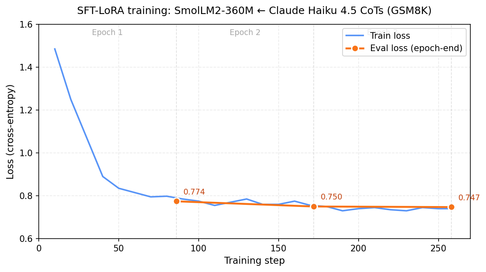

# Chain-of-Thought Distillation: SmolLM2-360M ← Claude Haiku 4.5

Fine-tuning a 360M-parameter open model on chain-of-thought solutions written by Claude Haiku 4.5, and measuring carefully what that actually buys you on GSM8K.

Short version: it buys you the teacher's format almost perfectly and its arithmetic barely at all. Accuracy went from 10.5% to 12.5% on 200 held-out problems, which is inside the noise band for a test set that size. The formatting transfer, by contrast, is unambiguous: 95% of the fine-tuned model's outputs end in a `#### <number>` answer marker, against a baseline that frequently trails off mid-sentence without committing to an answer at all.

[Model on HuggingFace](https://huggingface.co/kianshandi/smollm2-360m-gsm8k-distilled-haiku) · Trained on one Kaggle T4 (free tier) · ~$2.70 in API spend

---

## Results

| | Accuracy (200 held-out GSM8K) | 95% CI |
|---|---|---|
| SmolLM2-360M-Instruct, as released | 10.5% | [6.5%, 14.5%] |
| + LoRA SFT on 1,435 Haiku CoTs | 12.5% | [8.0%, 17.5%] |
| Paired difference | +2.0pp | [−3.0pp, +7.0pp] |

Paired bootstrap over per-problem outcomes, 2,000 resamples: P(fine-tuned ≤ baseline) ≈ 0.241. Four extra correct answers out of 200. The interval covers zero comfortably, so the honest statement is that this experiment did not establish that distillation helped accuracy, not that it helped a little.

That is worth sitting with, because the same recipe scaled up (DeepSeek-R1's distillation into 7B–70B students, Phi's textbook-style curricula) produces large, obvious gains. Something about 360M is different, and the qualitative side of the eval says what.

## What's in here

| Path | What it is |
|---|---|
| `smollm2_cot_distillation_polished.ipynb` | The whole pipeline: generation, filtering, training, eval, stats, plots. Runs top to bottom on a Kaggle T4. |
| `loss_curve.png` | Train/eval loss over the 3 epochs, exported from the notebook. |
| `requirements.txt` | Pinned versions. The pins matter; see the setup note below. |

There is no `src/` directory because there is no library here. It is one experiment, and one notebook is the honest shape for it.

## Pipeline

**1. Generate.** 1,500 GSM8K training problems (shuffled with `random.seed(7)`) go to `claude-haiku-4-5` with a system prompt asking for step-by-step reasoning ending in `#### <number>`, plus three few-shot demonstrations. Roughly 45 minutes wall clock and about $2.70: ~600 input tokens per call once you count the system prompt and few-shot block, ~250 output tokens, at Haiku's $1/$5 per million.

**2. Filter.** Keep only CoTs whose extracted final answer matches the GSM8K gold answer. 1,435 of 1,500 survive (95.7%). Standard rejection sampling; the student never sees a chain that ended in the wrong place.

**3. Train.** LoRA (r=16, α=32) over `q_proj`, `k_proj`, `v_proj`, `o_proj`, 3 epochs, effective batch 16, cosine schedule from 2e-4 with 5% warmup, bf16. About 260 optimizer steps and 20 minutes on a T4. The adapter is a few megabytes against a 720MB bf16 checkpoint, which is most of why LoRA is the right call here even though the model is small enough to full-fine-tune.

**4. Evaluate.** 200 problems from GSM8K's *test* split (`random.seed(42)`), greedy decoding, 512 max new tokens, batched at 8 with left-padding. The identical harness grades both models.

**5. Analyze.** Marginal and paired bootstrap CIs, then a side-by-side read of wins, regressions, and the cases where both models were wrong but for different reasons.

## The grader, and why it is the load-bearing part

Everything downstream is a comparison of two numbers produced by the same function, so that function is where bugs do the most damage. It appears three times in the pipeline: filtering Claude's output, grading the baseline, grading the fine-tuned model. Defining it once is not tidiness, it is the only way the delta means anything.

```python
def extract_answer(text):
    m = re.search(r"\\boxed\{([^}]+)\}", text)          # 1. LaTeX box
    if m: return _normalize(m.group(1))
    m = re.search(r"####\s*(-?[\d,]+\.?\d*)", text)     # 2. GSM8K marker
    if m: return _normalize(m.group(1))
    m = re.search(r"answer is\s*\$?(-?[\d,]+\.?\d*)", text, re.IGNORECASE)
    if m: return _normalize(m.group(1))
    nums = re.findall(r"-?[\d,]+\.?\d*", text)          # 4. last number, in desperation
    return _normalize(nums[-1]) if nums else None
```

Two properties of this are deliberate and both cut against the result I reported:

*The last-number fallback favors the baseline.* An untrained SmolLM2 that rambles through six numbers and stops gets credit if the last one happens to be right. The fine-tuned model, which commits to one number after `####`, gets no such lottery ticket. If anything this deflates the measured gain rather than inflating it.

*`answers_match` is lenient about units, and that leniency is coarse.* It exists because Haiku kept reasoning in cents while GSM8K's gold was in dollars, both correct, string comparison says no:

```python
for ratio in [100, 60, 24, 12, 1000, 7, 52, 365]:
    if g != 0 and abs(p / g - ratio) < 1e-4: return True
    if p != 0 and abs(g / p - ratio) < 1e-4: return True
```

This accepts any answer off by exactly one of those ratios, which means a genuinely wrong prediction of 700 against a gold of 7 is scored correct. I kept it because dropping it silently discarded ~5% of otherwise-good teacher CoTs, and because both models are graded by the same function so the bias is common-mode. But it is a real source of false positives in both columns, and a stricter grader (unit-aware only where the question mentions money or time) is the first thing I would change.

## Training



Epoch-end eval loss: 0.774 → 0.750 → 0.747. Train loss opens at 1.49 and is already flat around 0.74 by step 70, which is roughly 1,100 examples in, less than one full epoch. Epochs 2 and 3 buy almost nothing. Eval tracks train the whole way, so nothing is overfitting; the model simply has nothing left to extract from the data. If I ran this again I would train one epoch and spend the saved GPU time on a larger eval set.

One methodological wrinkle worth naming: the training labels are a straight copy of `input_ids`, so the loss covers the user's question as well as the assistant's solution. The usual practice is to mask the prompt tokens to `-100` and train only on the completion. With a fixed one-turn template and questions that are short relative to the CoTs the practical difference is small, but it does mean some capacity went into modeling GSM8K question phrasing rather than reasoning. That is an unforced error and it is fixable in about five lines.

## What transferred

The output change is large and immediate. Same problem, both models:

**Baseline**

```
The current measurement is 47 WPM.
The next measurement is 52 WPM.
The third measureme... [continues, never commits to an answer]
```

**Fine-tuned**

```
I need to find the average of the three measurements.

**Initial measurement:** 47 WPM
**Next measurement:** 52 WPM
**Third measurement:** 52 WPM + 5 WPM = 57 WPM
**Average:** (47 + 52 + 57) / 3 = 150 / 3 = 50 WPM

#### 50
```

That answer is wrong. The model read "5 more than the previous" as applying to a value it had already consumed, so it fabricated a third measurement. But look at what it got right: it stated the goal, laid out the givens under bolded headers, did the division explicitly, and emitted the answer marker. It failed in the shape of a correct solution.

Across the held-out set:

| | Fine-tuned |
|---|---|
| Outputs ending with a `####` marker | 190 / 200 (95%) |
| Median generation length | 416 chars |
| Bolded step headers | most outputs |

Format is cheap to learn. It is a surface statistic over tokens, and 1,435 examples of it is plenty. Multi-step arithmetic is not a surface statistic, and no amount of scaffolding conjures it out of 360M parameters.

## Where it fails

Of the 175 wrong predictions, three patterns account for nearly all of them.

**Arithmetic slips inside a correct plan.** The model picks the right framework, walks it cleanly, and drops a digit somewhere in the middle. These are the most frustrating failures because everything except one operation is right, and they are exactly what a process reward model would catch.

**Misreading the problem.** Confusing who owns what, which quantity depends on which, whether a number is a total or a rate. This is a comprehension failure rather than a computation failure, and CoT formatting does nothing for it.

**Repetition collapse.** Around 5% of generations fall into a loop:

```
...5 footballs
**Half as many footballs as footballs kept there:**
5 footballs
**Half as many footballs as footballs kept there:**
5 footballs
```

These burn the full 512-token budget and never produce an answer. Greedy decoding has no escape from a high-confidence rut. I re-ran the eval with `temperature=0.3` sampling to check whether the loops were a decoding artifact; accuracy came out at 12.0%, statistically identical. Some loops broke, the answers still weren't right, which points at capacity rather than the sampler.

## Statistics

The 200 problems are the same 200 under both models, so independent CIs on each accuracy throw away the pairing and overstate the uncertainty on the difference. Bootstrapping the per-problem difference instead controls for the fact that some problems are simply harder:

```python
diff = ft_correct - baseline_correct            # per-problem, in {-1, 0, 1}
rng = np.random.default_rng(123)
diff_boots = np.array([diff[rng.integers(0, len(diff), len(diff))].mean()
                       for _ in range(2000)])
diff_ci = np.percentile(diff_boots, [2.5, 97.5])
p_value = (diff_boots <= 0).mean()
```

```
Baseline:    10.5%  [95% CI:  6.5%, 14.5%]
Fine-tuned:  12.5%  [95% CI:  8.0%, 17.5%]
Paired Δ:    +2.0pp [95% CI: -3.0pp, +7.0pp]
P(Δ ≤ 0) ≈ 0.241
```

At 200 problems and a ~10% base rate, the CI half-width is around 5pp no matter what you do, so this design could never have resolved a 2pp effect. Detecting it would need something on the order of a thousand problems. I sized the eval before I knew how small the effect would be; sizing it from a power calculation instead would have been the better move, and it would have cost about 40 minutes more of T4 time.

## Caveats that could change the conclusion

**Teacher contamination.** Haiku 4.5 has almost certainly seen GSM8K. Its CoTs are therefore not independent of the benchmark, even though the student never touches the test split. This is endemic to CoT distillation papers on public benchmarks and it is a reason to treat GSM8K numbers as a sanity check rather than evidence.

**Rejection sampling narrows the distribution.** Training only on chains that landed on the right answer means the student never sees reasoning that looks plausible and ends up wrong. That is the standard recipe, but it is plausibly part of why the model happily produces confident, well-formatted nonsense: it has no examples of what failure looks like.

**One seed, one run.** No variance estimate over training runs. A 2pp difference is well within what seed variation alone could produce for a run this small.

**Grader leniency**, discussed above.

## Notes from building it

A few things I would tell myself at the start.

Examples beat instructions, and it is not close. My first system prompt told Claude to reason in dollars rather than cents. Claude ignored it, steadily, producing `#### 300` where gold was `3`. I checked that the prompt was actually reaching the API before blaming the model. Three few-shot demonstrations that *showed* a cent-to-dollar conversion fixed it on the first attempt. When a model ignores an instruction, adding more forceful wording is usually the wrong reflex; show it the behavior instead.

Build the eval before the training cell. I measured the baseline first, and doing so surfaced a bug in answer extraction that would have quietly invalidated the delta. A number you obtained after training, with no rigorously-measured before, is not a result. Related: test the comparison function on hand-picked adversarial cases (cents vs. dollars, `3.0` vs `3`, outputs containing five numbers) before you point it at a thousand examples.

Choose a base model with headroom. I ran the same recipe against Qwen2.5-1.5B as a check and it started at roughly 67% on GSM8K, leaving almost nothing for distillation to demonstrate. Too capable a starting point hides the effect; too weak a starting point shows you what the method cannot do. The second is what happened here, and it turned out to be the more instructive outcome.

Constraints are clarifying. A free T4 with 16GB and a weekly quota forced LoRA over full fine-tuning, a 360M base, and batch 4 with gradient accumulation. Every one of those was the right call anyway. Working under a budget pushes you toward problems where the bottleneck is your understanding rather than your hardware.

And the obvious one: a 360M model going from 10.5% to 12.5% is not a headline. I could have swapped in a bigger base until the number looked better, or quietly reported the marginal CIs instead of the paired one. The pipeline and the rigor are the same either way, and the qualitative finding (format transfers, capability does not) is more interesting than a flattering delta would have been.

## What I would do next

**Fix the eval first.** 1,000+ held-out problems and a tighter grader, so any subsequent claim is actually measurable. Cheap, unglamorous, and a precondition for everything else on this list.

**GRPO instead of SFT.** GSM8K rewards are verifiable (did the final answer match?), which is exactly the setting where policy-gradient RL beats imitation. The same 1,500 problems become RL prompts without regenerating any teacher data.

**A larger student.** Qwen2.5-1.5B or Llama-3.2-1B under the identical recipe would separate "the ceiling is 360M" from "the ceiling is this recipe."

**Process reward modeling.** The dominant failure mode is a correct plan with one bad step. Grading intermediate steps rather than only final answers targets that directly, and it is the natural fix for a model that has learned to look right.

## Reproducing it

Open `smollm2_cot_distillation_polished.ipynb` on Kaggle with a T4 accelerator, set `ANTHROPIC_API_KEY` and `HF_TOKEN` as Kaggle secrets, and run top to bottom. Budget roughly 45 min for generation, 10 min for baseline eval, 20 min for training, 10 min for the fine-tuned eval, and $3 of API credit.

The generation stage is cached: if `filtered_cots.json` already exists in the working directory the notebook skips the API calls entirely, so you can re-run the training and eval sections without paying twice.

Seeds are fixed throughout (`random.seed(7)` for teacher problem selection, `random.seed(42)` for the train/eval split and the held-out sample, `np.random.default_rng(42)` and `(123)` for the two bootstraps). Greedy decoding makes eval deterministic. Training on the same GPU and pinned versions reproduces closely, though not bit-for-bit across different hardware.

A setup note that cost me an hour: the notebook explicitly uninstalls `bitsandbytes`. Kaggle's preinstalled `triton` is incompatible with `bitsandbytes==0.44.1`'s import path, and bf16 LoRA on a 360M model does not need 8-bit quantization anyway. TRL is likewise skipped in favor of `transformers.Trainer` plus `peft` directly, which is fewer moving parts for a job this simple.

Inference on the trained adapter, merged and pushed to the Hub:

```python
from transformers import pipeline

pipe = pipeline("text-generation",
                model="kianshandi/smollm2-360m-gsm8k-distilled-haiku")
pipe([{"role": "user",
       "content": "If a pencil costs 30 cents, how much do 4 pencils cost?"}],
     max_new_tokens=256, do_sample=False)
```

## Configuration

| | |
|---|---|
| Base model | `HuggingFaceTB/SmolLM2-360M-Instruct` |
| Teacher | `claude-haiku-4-5` |
| Teacher calls | 1,500 (3 few-shot demos + system prompt per call) |
| Training data | 1,435 filtered (question, CoT) pairs; 1,385 train / 50 eval |
| LoRA rank / alpha / dropout | 16 / 32 / 0.05 |
| LoRA targets | `q_proj`, `k_proj`, `v_proj`, `o_proj` |
| Epochs | 3 (~260 optimizer steps) |
| Effective batch size | 16 (per-device 4 × grad accum 4) |
| Learning rate | 2e-4, cosine, 5% warmup |
| Precision | bf16 |
| Max sequence length | 1,024 |
| Held-out test set | 200 problems, GSM8K test split |
| Decoding | greedy, 512 max new tokens, batch 8, left-padded |
| Compute | 1 × NVIDIA T4, Kaggle free tier |
| Training wall clock | ~20 min |
| API cost | ~$2.70 |

## License and credits

Base model: [SmolLM2-360M-Instruct](https://huggingface.co/HuggingFaceTB/SmolLM2-360M-Instruct) (Apache 2.0), HuggingFaceTB. Problems from [GSM8K](https://github.com/openai/grade-school-math) (MIT), OpenAI. Chain-of-thought solutions generated with Claude Haiku 4.5 (Anthropic). The adapter in this repo is released under Apache 2.0.

Built at UCLA, 2026.
